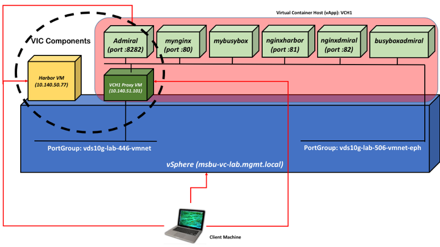

This page is intended to guide you through setting up a complete vSphere Integrated Containers (VIC) stack.

## Components Overview

VIC is comprised of three major components:

- VIC Engine: this is responsible for exposing vSphere constructs as Docker constructs
- Harbor: this is a Docker compatible enterprise registry
- Admiral: this provides a portal on top of the Virtual Container Hosts.   

The setup architecture that is described in this page may change for future releases.

## vSphere pre-requisites

Before you start, make sure you have a vSphere environment that satisfy [these requirements](https://vmware.github.io/vic/assets/files/html/vic_installation/vic_installation_prereqs.html).

### The client machine  

To setup VIC you only need a working vSphere environment as well as a client machine from where you will install and then interact with all the VIC components. The client machine plays the following roles:

- A system to run vic-machine to deploy and manage VCH endpoints in vSphere.
- A system to deploy the Harbor OVA (delivered as a virtual appliance).
- A Docker client to exercise VIC Engine and to deploy Admiral on top of the Virtual Container Host we will deploy.
- A Web browser to manage the components that require UI interaction.

## Setup instructions

These instructions will guide you through the process of setting up vSphere Integrated Containers (all three components) and deploy various sample containers to exercise the behaviour of the solution.

- [Preparing the client machine](preparing-the-client-machine.md)

- [Installing and configuring Harbor](install-configure-harbor.md)

- [Installing and configuring the Virtual Container Host (VCH)](install-configure-vch.md)

- [Installing and configuring Admiral](install-configure-admiral.md)

- [Using Harbor](using-harbor.md)

- [Deploying a simple container via Admiral](deploy-simple-container-via-admiral.md)

- [Known Issues and Limitations](known-issues-limitations.md)

## Outcome

If you (strictly) follow the instructions above the diagram below outlines the end result you are going to achieve.

You should consider the VCH1 proxy VM, the Harbor VM and the Admiral ContainerVM the components that comprise VIC. You should consider every other containerVM being deployed inside the VCH1 vSphere vApp as "user workloads".  
