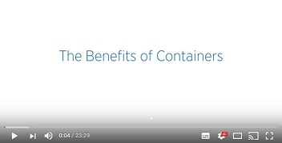
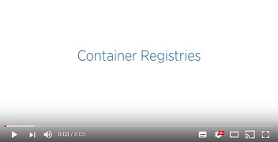

# Overview of vSphere Integrated Containers #

vSphere Integrated Containers enables IT teams to seamlessly run traditional and container workloads side-by-side on existing vSphere infrastructure. 

- [Introduction to Containers, Docker, and Registries](#containers)
- [Introduction to Container Images and Volumes](#images)
  - [Container Runtime](#runtime)
  - [Packaging](#packaging) 
- [What is vSphere Integrated Containers?](#whatis_vic)
- [What Does vSphere Integrated Containers Do?](#what_vic_does)
- [What Is vSphere Integrated Containers Engine?](#whats_vic_for)
  - [vSphere Integrated Containers Engine Concepts](#concepts)
    - [Container VMs](#containervm) 
    - [Virtual Container Hosts](#vch) 
    - [The VCH Endpoint VM](#endpoint) 
    - [The vic-machine Utility](#vic-machine) 
- [What Is vSphere Integrated Containers Management Portal?](#whats_portal)
  - [Projects and Role-Based Access Control](#projects)
  - [User Authentication](#authentication)
- [What Is vSphere Integrated Containers Registry?](#whats_registry)
  - [Rule-Based Image Replication](#replication)
  - [Docker Content Trust](#notary)
  - [Vulnerability Scanning](#vulnerability)
  - [Garbage Collection](#gc)
  - [Logging](#logging)

## Introduction to Containers, Docker, and Registries 

For an introduction to containers and Docker before reading further, watch the following videos on the [VMware Cloud-Native YouTube Channel](https://www.youtube.com/channel/UCdkGV51Nu0unDNT58bHt9bg):

  

   

    

The following resources on docker.com and elsewhere are also useful:

- [Docker glossary](https://docs.docker.com/glossary/)
- [Get Started with Docker](https://docs.docker.com/get-started/)
- [Docker Sandbox](http://labs.play-with-docker.com/)
- [Play with Docker Classroom](http://training.play-with-docker.com/)

## Introduction to Container Images and Volumes

When understanding containers and how they relate to vSphere Integrated Containers, it is helpful to distinguish the *runtime* aspect of containers from the *packaging* aspect.

### Container Runtime 

At its most basic, a container is simply a sandbox in which a process can run. The sandbox isolates the process from other processes that are running on the same system. A container has a lifecycle which is typically tied to the lifecycle of the process that it is designed to run. If you start a container, it starts its main process and when that process ends, the container stops. The container might have access to some storage. It typically has an identity on a network.

Conceptually, a container represents many of the same capabilities as a VM. The main difference between the two is the abstraction layer:

* A software container is a sandbox within a guest OS and it is up to the guest to provide the container with its dependencies and to enforce isolation. Multiple containers share the guest kernel, networking, and storage. A container does not boot. It is simply a slice of an already-running OS. The OS running the container is called its *host*.

* In contrast, a VM is a sandbox within a hypervisor. It is the hypervisor that provides a VM with its dependencies, such as virtual disks and NICs. A VM has to boot an OS and its lifecycle is typically tied to that of the OS rather than to that of any one process. By design, a VM is strongly isolated from other VMs and its host.

One of the most interesting facets of containers is how they deal with state. Any data that a container writes is non-persistent by default and is lost when that container is deleted. State, however, can persist beyond the lifespan of a container by attaching a *volume* to it or by sending it over a network. Binary dependencies that the container needs, such as OS libraries or application binaries, are encapsulated in *images*. Images are immutable.

### Container Packaging 

One of the most significant benefits of containers is that they allow you to package up the entire environment that an application needs and run it anywhere. You can go to Docker Hub, select from hundreds of thousands of applications and run that application anywhere that you have installed Docker on a compatible OS. The packaging encapsulates the binary dependencies, environment variables, volumes, and even the network configuration. 

The format of this packaging is called an *image*. An image is a template from which many containers can instantiate. The Docker image format allows for images to be composed in a parent-child relationship, just like a disk snapshot. This image hierarchy allows containers to share common dependencies. For example, you might have a Debian 8 image that has a child image with Java installed. That Java image might have a child with Tomcat installed. The Debian 8 image might have other children, such as PHP, Python, and so on. 

The immutability of the image format means that you never modify an image, you always create a new one. The layered nature of the image format means that you can cache commonly-used layers so that you only need to download or upload the layers that you do not already have. It also means that if you want to patch a particular image, you create a new image and then rebuild all of its children. 

The main advantage of the image format is its portability. As long as you have a destination that is running a container engine, for example Docker, you can download and run an image on it. This portability is facilitated by a *registry*. A registry is a service that indexes and stores images. You can run your own private image registry that forms part of a development pipeline. You can *push* images to the registry from development, *pull* them into a test environment for verification, and then *pull* them into a production environment.

## What is vSphere Integrated Containers? 

vSphere Integrated Containers is delivered as an appliance, that comprises the following major components:

- **vSphere Integrated Containers Engine**, a container runtime for vSphere that allows you to provision containers as virtual machines, offering the same security and functionality of virtual machines in VMware ESXi&trade; hosts or vCenter Server&reg; instances. 
- **vSphere Integrated Containers Plug-In for vSphere Client**, that provides information about your vSphere Integrated Containers setup and allows you to deploy virtual container hosts directly from the vSphere Client.
- **vSphere Integrated Containers Registry**, an enterprise-class container registry server that stores and distributes container images. vSphere Integrated Containers Registry extends the Docker Distribution open source project by adding the functionalities that an enterprise requires, such as security, identity and management.
- **vSphere Integrated Containers Management Portal**, a container management portal that provides a UI for DevOps teams to provision and manage containers, including the ability to obtain statistics and information about container instances. Cloud administrators can manage container hosts and apply governance to their usage, including capacity quotas and approval workflows. Cloud administrators can create projects, and assign users and resources such as registries and virtual container hosts to those projects.

These components currently support the Docker image format. vSphere Integrated Containers is entirely Open Source and free to use. Support for vSphere Integrated Containers is included in the vSphere Enterprise Plus license.

vSphere Integrated Containers is designed to solve many of the challenges associated with putting containerized applications into production. It directly uses the clustering, dynamic scheduling, and virtualized infrastructure in vSphere and bypasses the need to maintain discrete Linux VMs as container hosts.

vSphere Integrated Containers allows the vSphere administrator to provide a container management endpoint to a user as a service. At the same time, the vSphere administrator remains in complete control over the infrastructure that the container management endpoint service depends on. The main differences between vSphere Integrated Containers and a classic container environment are the following:

- vSphere, not Linux, is the container host:
  - Containers are deployed *as* VMs, not *in* VMs.
  - Every container is fully isolated from the host and from the other containers.
  - vSphere provides per-tenant dynamic resource limits within a vCenter Server cluster.
- vSphere, not Linux, is the infrastructure:
  - You can select vSphere networks that appear in the Docker client as container networks.
  - Images, volumes, and container state are provisioned directly to VMFS.
- vSphere is the control plane:
  - Use the Docker client to directly control selected elements of vSphere infrastructure.
  - A container endpoint Service-as-a-Service presents as a service abstraction, not as IaaS.

vSphere Integrated Containers is designed to be the fastest and easiest way to provision any Linux-based workload to vSphere, if that workload can be serialized as a Docker image.

## What Does vSphere Integrated Containers Do? 

vSphere Integrated Containers gives the vSphere administrator the tools to easily make the vSphere infrastructure accessible to users so that they can provision container workloads into production.

**Scenario 1: A Classic Container Environment**

In a classic container environment: 

- A user raises a ticket and says, "I need Docker". 
- The vSphere administrator provisions a large Linux VM and sends them the IP address.
- The user installs Docker, patches the OS, configures in-guest network and storage virtualization, secures the guest, isolates the containers, packages the containers efficiently, and manages upgrades and downtime. 
 
In this scenario, what the vSphere administrator has provided is similar to a nested hypervisor, that is opaque and that they have to manage. If they scale that up to one large Linux VM per tenant, they end up creating a large distributed silo for containers.

**Scenario 2: vSphere Integrated Containers**

With vSphere Integrated Containers: 

- A user raises a ticket and says, "I need Docker". 
- The vSphere administrator identifies datastores, networking, and compute resources on a cluster that users can use for their Docker environment. 
- The vSphere administrator uses the vSphere Integrated Containers plug-in for the vSphere Client or a command-line utility called `vic-machine` to install a small appliance, called a virtual container host (VCH). The VCH represents an authorization to use the infrastructure that they have identified, into which users can self-provision container workloads.
- The appliance runs a secure remote Docker API, that is the only access that the user has to the vSphere infrastructure.
- Instead of sending the user a Linux VM, the vSphere administrator sends them the IP address of the appliance, the port of the remote Docker API, and a certificate for secure access.

In this scenario, the vSphere administrator has provided the user with a service portal. This is better for the user because they do not have to worry about isolation, patching, security, backup, and so on. It is better for the vSphere administrator because every container that the user deploys is a container VM. vSphere administrators can perform vMotion and monitor container VMs just like all of their other VMs.

If the user needs more compute capacity, in Scenario 1, the pragmatic choice is to power down the VM and reconfigure it, or give the user a new VM and let them deal with the clustering implications. Both of these solutions are disruptive to users. With vSphere Integrated Containers in Scenario 2, the vSphere administrator can reconfigure the VCH in vSphere, or redeploy it with a new configuration in a way that is completely transparent to the user.

vSphere Integrated Containers allows the vSphere administrator to select and dictate the appropriate infrastructure for the task in hand:

- Networking: Select multiple port groups for different types of network traffic, ensuring that all of the containers that a user provisions get the appropriate interfaces on the right networks.
- Storage: Select different vSphere datastores for different types of state. For example, container state is ephemeral and is unlikely to need to be backed up, but volume state almost certainly should be backed up. vSphere Integrated Containers automatically ensures that state gets written to the appropriate datastore when the user provisions a container.

To summarize, vSphere Integrated Containers gives vSphere administrators a mechanism that allows users to self-provision VMs as containers into the virtual infrastructure.

## What is vSphere Integrated Containers Engine? 

vSphere Integrated Containers Engine currently offers a subset of the Docker API. It is designed to specifically address the provisioning of containers into production, solving many of the problems highlighted in [What Does vSphere Integrated Containers Do?](#what_vic_does).

vSphere Integrated Containers Engine exploits the portability of the Docker image format to present itself as an enterprise deployment target. Developers build containers on one system and push them to a registry. Containers are tested by another system and are approved for production. vSphere Integrated Containers Engine can then pull the containers out of the registry and deploy them to vSphere.

### vSphere Integrated Containers Engine Concepts 

If you consider a Venn diagram with "What vSphere Does" in one circle and "What Docker Does" in another, the overlap is significant. The objective of vSphere Integrated Containers Engine is to take as much of vSphere as possible and layer whatever Docker capabilities are missing on top, reusing as much of Docker's own code as possible. The  result should not sacrifice the portability of the Docker image format and should be completely transparent to a Docker client. The following sections describe key concepts and components that make this possible.

#### Container VMs 

The container VMs that vSphere Integrated Containers Engine creates have all of the characteristics of software containers:

- An ephemeral storage layer with optionally attached persistent volumes.
- A custom Linux guest OS that is designed to be "just a kernel" and that needs images to be functional.
- A mechanism for persisting and attaching read-only binary image layers.
- A PID 1 guest agent *tether* extends the control plane into the container VM.
- Various well-defined methods of configuration and state ingress and egress
- Automatically configured to various network topologies.

The provisioned container VM does not contain any OS container abstraction. 

- The container VM boots from an ISO that contains the Photon Linux kernel. Note that container VMs do not run the full Photon OS.
- The container VM is configured with a container image that is mounted as a disk. 
- Container image layers are represented as a read-only VMDK snapshot hierarchy on a vSphere datastore. At the top of this hierarchy is a read-write snapshot that stores ephemeral state. 
- Container volumes are formatted VMDKs that are attached as disks and indexed on a datastore. 
- Networks are distributed port groups that are attached as vNICs.

#### Virtual Container Hosts 

A virtual container host (VCH) is the functional equivalent of a Linux VM that runs Docker, but with some significant benefits. A VCH represents the following elements:
- A clustered pool of resource into which to provision container VMs.
- A single-tenant container namespace.
- An isolated Docker API endpoint. 
- Authorization to use and configure pre-approved virtual infrastructure.
- A private network that containers are attached to by default.

If you deploy a VCH in a vCenter Server cluster, it spans all of the hosts in the cluster, providing the same flexibility and dynamic use of host resources as is the norm.

A VCH is functionally distinct from a traditional container host in the following ways:

- It naturally encapsulates clustering and dynamic scheduling by provisioning to vSphere targets.
- The resource constraints are dynamically configurable with no impact on the containers.
- Containers do not share a kernel.
- There is no local image cache. This is kept on a datastore in the cluster that you specify when you deploy a VCH. 
- There is no read-write shared storage

A VCH is a multi-functional appliance that you deploy as a resource pool in a vCenter Server cluster or on an ESXi host. The resource pool provides a useful visual parent-child relationship in the vSphere Client so that you can easily identify the container VMs that are provisioned into a VCH. You can also specify resource limits on the resource pool. You can provision multiple VCHs onto a single ESXi host, into a vSphere resource pool, or into a vCenter Server cluster.

#### The VCH Endpoint VM 

The VCH endoint VM is the VM that runs inside the VCH resource pool. There is a 1:1 relationship between a VCH and a VCH endpoint VM. The VCH endpoint VM provides the following functions:

- Runs the services that a VCH requires.
- Provides a secure remote API to a client.
- Receives Docker commands and translates those commands into vSphere API calls and vSphere infrastructure constructs.
- Provides network forwarding so that ports to containers can be opened on the VCH endoint VM and the containers can access a public network.
- Manages the lifecycle of the containers, the image store, the volume store, and the container state
- Provides logging and monitoring of its own services and of its containers.

The lifecycle of the VCH endpoint VM is managed by a utility called `vic-machine`. 

#### The `vic-machine` Utility 

The `vic-machine` utility is a binary for Windows, Linux, and OSX that manages the lifecycle of VCHs. `vic-machine` has been designed for use by vSphere administrators. It takes pre-existing compute, network, storage and a vSphere user as input and creates a VCH as output. It has the following additional functions:

- Creates certificates for Docker client TLS authentication.
- Checks that the prerequisites for VCH deployment are met on the cluster or host, namely that the firewall, licenses, and so on are configured correctly.
- Configures existing VCHs for debugging.
- Lists, inspects, upgrades, configures, and deletes VCHs.

The `vic-machine` utility also runs as a service in the vSphere Integrate Containers appliance. This service powers the Create Virtual Container Host wizard in the HTML5 vSphere Client plug-in, to allow you to deploy VCHs interactively from the vSphere Client.

## What Is vSphere Integrated Containers Management Portal? 

vSphere Integrated Containers Management Portal is a highly scalable and very lightweight container management platform for deploying and managing container based applications. The management portal runs as a container in the vSphere Integrated Containers virtual appliance. It is designed to have a small footprint and boot extremely quickly. vSphere Integrated Containers Management Portal is intended to provide DevOps administrators with automated deployment and lifecycle management of containers.

- Resource management, allowing DevOps administrators to set deployment preferences which lets vSphere Integrated Containers Management Portal manage container placement.
- Live state updates that provide a live view of the container system.
- Multi-container template management, that enables logical multi-container application deployments.

For more information about vSphere Integrated Containers Management Portal, see [Configure and Manage vSphere Integrated Containers](../vic_cloud_admin/).

### Projects and Role-Based Access Control 

In vSphere Integrated Containers Management Portal, you organize repositories in projects. "Repository" is Docker terminology for a collection of container images that have the same name but that have different tags. You assign users, registries, and VCHs to the projects and you assign roles with different permissions to the users in each project. There are two types of project in vSphere Integrated Containers Registry:  

  - **Public projects**: All users can pull images from the project. Users must be members of a project and have the appropriate privileges to push images to the project.
  - **Private projects**: Only members of the project can pull images from private private projects. Members must have the appropriate privileges to be able to push images to the project.

When you first deploy vSphere Integrated Containers, a default public project named `default-project` is created, that includes the default vSphere Integrated Containers Registry instance. You can toggle projects from public to private, or the reverse, at any moment.

### User Authentication 

vSphere Integrated Containers is fully integrated with VMware Platform Services Controller. The Platform Services Controller provides common infrastructure services to the vSphere environment. Services include licensing, certificate management, and authentication with vCenter Single Sign-On. With vCenter Single Sign-On you can use local users created in the Platform Services Controller or configure external identity sources. 

For more information about, deploying, configuring, and working with Platform Services Controller, see the [Platform Services Controller Administration Guide](https://docs.vmware.com/en/VMware-vSphere/6.5/com.vmware.psc.doc/GUID-9451A5B4-5747-42C1-8A82-83AFCC1F2861.html) in the VMware vSphere documentation.

You can pull users from the Platform Services Controller and assign them roles through the vSphere Integrated Containers Management Portal.

You can deploy multiple vSphere Integrated Containers appliances to the same vCenter Server instance. Also, if a Platform Services Controller manages multiple vCenter Server instances, you can deploy multiple appliances to different vCenter Server instances that share that Platform Services Controller. In either of these setups, the appliances all register with the same Platform Services Controller, and can pull users from that Platform Services Controller. These setups allow the same user to have different roles in different vSphere Integrated Containers instances.

## What Is vSphere Integrated Containers Registry? 

vSphere Integrated Containers Registry is an enterprise-class registry server that you can use to store and distribute container images. The registry runs as a container in the vSphere Integrated Containers virtual appliance. vSphere Integrated Containers Registry allows DevOps administrators to organize image repositories in projects, and to set up role-based access control to those projects to define which users can access which repositories. vSphere Integrated Containers Registry also provides rule-based replication of images between registries, implements Docker Content Trust and vulnerability scanning, and provides detailed logging for project and user auditing.

### Rule Based Image Replication 

You can set up multiple registries and replicate images between registry instances. Replicating images between registries helps with load balancing and high availability, and allows you to create multi-datacenter, hybrid, and multi-cloud setups. For information about image replication, see [Replicating Images](../vic_cloud_admin/replicating_images.md).

### Docker Content Trust 

vSphere Integrated Containers Registry provides a Docker Notary server that allows you to implement Docker Content Trust by signing and verifying the images in the registry. For information about Docker Notary, see [Content trust in Docker](https://docs.docker.com/engine/security/trust/content_trust/) in the Docker documentation. 

The Notary server runs by default. For information about how container developers use Docker Content Trust with vSphere Integrated Containers Registry, see [Configure the Docker Client for Use with vSphere Integrated Containers](../vic_app_dev/configure_docker_client.md) in *Develop Container Applications with vSphere Integrated Containers*.

### Vulnerability Scanning 

vSphere Integrated Containers Registry provides the ability to scan all images for known vulnerabilities. DevOps and cloud dministrators can set threshold values that prevent users from running vulnerable images that exceed those thresholds. Once an image is uploaded into the registry, vSphere Integrated Containers Registry checks the various layers of the image against known vulnerability databases and reports issues to the DevOps and cloud administrators. 

### Garbage Collection 

You can configure vSphere Integrated Containers Registry to perform garbage collection whenever you restart the registry service. If you implement garbage collection, the registry recycles the storage space that is consumed by images that you have deleted. For more information about garbage collection, see [Manage Repositories](../vic_cloud_admin/manage_repository_registry.md). See also [Garbage Collection](https://docs.docker.com/registry/garbage-collection/) in the Docker documentation.

### Logging 

vSphere Integrated Containers Registry keeps a log of every operation that users perform in a project. The logs are fully searchable, to assist you with activity auditing. For information about project logs, see [Access Project Logs](../vic_cloud_admin/access_project_logs.md).
