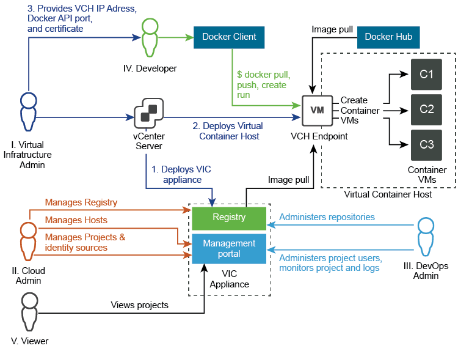

# Roles and Personas # 

vSphere Integrated Containers requires a vSphere administrator role for deployment and provides four additional roles for user access. The viewer role has the lowest level of access with the global cloud administrator having the highest.

Permissions per role are described below in reversed order, as every next role listed inherits the permissions of the previous role and has additional ones.

**V. Viewer**

Role assigned per project.
- If assigned, role only has view access to the repositories for a project.

**IV. Developer**

Role assigned per project. In addition to the view access, for their assigned projects developers can also:
- Provision containers
- Push images into registries
- Create and import templates

**III. DevOps Administrator**

Role assigned per project. For their assigned projects DevOps administrators can perform additional actions:
- Add developers and viewers and assign other DevOps administrators
- Change the project configurations, such as making the project registry public, changing deployment security settings, and enabling vulnerability scanning

**II. Cloud administrator / Global Administrator for all projects**

The cloud administrator role is assigned to the Administrators group for vCenter Server during the installation of vSphere Integrated Containers. Through the management portal, you can revoke that role for the Administrators group, only after you assign the role to another group. Cloud administrators can also assign the role to individual users.

The following global permissions are unique to the cloud administrator role:
- Add new cloud administrators
- Create new projects and assign the first DevOps administrator to them
- Add hosts as resources to a given project
- Add and manage registries, replication endpoints, and replication rules
- Add predefined credentials and certificates for authentication
- Set global configurations for registries
- View system logs

**I. vSphere administrator**

vSphere administrators prepare, install, and set up vSphere Integrated Containers. The typical workflow includes the following actions:
- Deploy the vSphere Integrated Containers appliance
- Deploy Virtual Container Hosts
- Provide the information for the deployed assets to vSphere Integrated Containers users
- Assign Cloud administrators
- Perform update and upgrade procedures for vSphere Integrated Containers
 
## Example Users #####

You can create example Cloud administrator, DevOps administrator, and a Developer users during the deployment of vSphere Integrated Containers appliance. These users are created as local users in the Platform Services Controller. By default, when you use the option to create example users, you end up with the following users:
- vic-cloud-admin@*local_domain*
- vic-devops-admin@*local_domain*
- vic-developer@*local_domain*