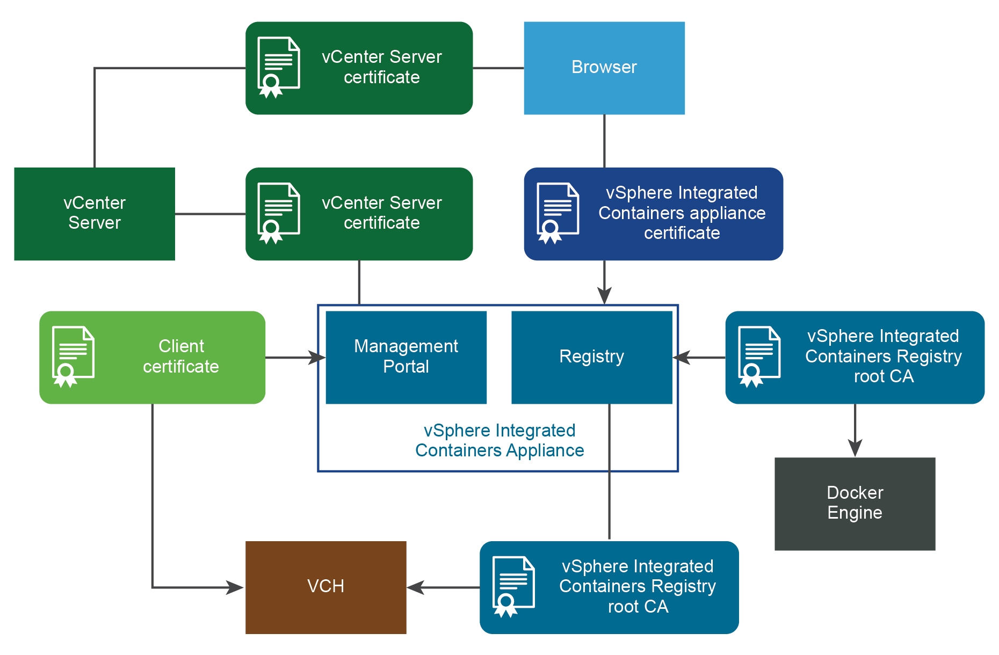

# vSphere Integrated Containers Appliance Certificate Requirements #

vSphere Integrated Containers authenticates connections between its various components by using TLS certificates. In some cases, the certificates are always automatically generated and self-signed. In other cases, you have the option of providing custom certificates. 

**IMPORTANT**: The certificate requirements for the appliance and for virtual container hosts (VCHs) are different. For information about how VCHs use certificates, see [Virtual Container Host Certificate Requirements](vch_cert_reqs.md). 

## Overview of vSphere Integrated Containers Appliance Certificate Use 

This diagram shows how the vSphere Integrated Containers appliance uses certificates to authenticate connections between the different components. The diagram shows a deployment in which verification of client certificates is enabled on virtual container hosts (VCHs).

The sections below describe the purpose and requirements of each of the certificates shown in the diagram.

## vSphere Integrated Containers Appliance Certificate 

vCenter Server verifies the vSphere Integrated Containers appliance certificate to authenticate connections to Management Portal, Registry, and the file server during initialization.

Browsers verify vSphere Integrated Containers appliance certificate to access vSphere Integrated Containers Management Portal, Getting Started page, vSphere Integrated Containers Engine download, and so on.

- **Type**: Self-signed or custom
- **Format**: Supports unencrypted PEM encoded PKCS#1 and unencrypted PEM encoded PKCS#8 formats for TLS private keys. If you provide a PKCS#1 format certificate, vSphere Integrated Containers converts it to PKCS#8 format.
- **Used by**: vSphere administrator, Management Portal administrators, DevOps admininistrators, developers

Authenticates connections from browsers to vSphere Integrated Containers Management Portal, the Getting Started page, downloads of vSphere Integrated Containers Engine binaries, and the installation of vSphere Client plug-ins. Also authenticates the Management Portal, Registry, and file server connections with vCenter Server during initialization of the appliance. The appliance uses a single TLS certificate for all of the services that run in the appliance.

To use a certificate that uses a chain of intermediate CAs, create a certificate chain PEM file that includes a chain of the intermediate CAs all the way down to the root CA. For examples of how to provide a custom certificate to the appliance during deployment, see [Deploy the vSphere Integrated Containers Appliance](deploy_vic_appliance.md).

For information about where to obtain auto-generated appliance certificates after deployment, see [Obtain the Thumbprints and CA Files of the vSphere Integrated Containers Appliance Certificates](obtain_appliance_certs.md) and [Verify and Trust vSphere Integrated Containers Appliance Certificates](../vic_cloud_admin/trust_vic_certs.md).

## vSphere Integrated Containers Registry Root CA 

VCHs require the registry root CA to pull images from vSphere Integrated Containers Registry.

Docker Engine requires registry root CA to push and pull images to and from vSphere Integrated Containers Registry.

- **Type**: Self-signed
- **Format**: Auto-generated `*.pem` file
- **Used by**: Management Portal administrators, DevOps admininistrators, developers

Authenticates connections to vSphere Integrated Containers Registry instances from VCHs, Docker clients, replication of projects between registry instances, and registration of additional registry instances in the management portal. The registry root CA is always automatically generated. For information about how to obtain the registry certificate after deployment of the appliance, see [Configure System Settings](../vic_cloud_admin/configure_system.md).

## VCH Client Certificate 

vSphere Integrated Containers Management Portal uses a client certificate to authenticate with a VCH when you add it to a project.

- **Type**: Self-signed or custom
- **Format**: PKCS#12, RSA/PKCS#1, or PKCS#7 with a private key in PKCS#8 format
- **Used by**: vSphere administrator, Management Portal administrators

For more information about the VCH client certificate, see [Virtual Container Host Certificate Requirements](vch_cert_reqs.md).

## vCenter Server Certificate 

The vSphere Integrated Containers appliance verifies the vCenter Server certificate thumbprint during initialization. Browsers verify the vCenter Server certificate to connect to vSphere Client and access the vSphere Integrated Containers plug-in. 

- **Type**: Self-signed or custom
- **Format**: See [vSphere Security Certificates](https://docs.vmware.com/en/VMware-vSphere/6.7/com.vmware.psc.doc/GUID-779A011D-B2DD-49BE-B0B9-6D73ECF99864.html) in the vSphere documentation
- **Used by**: vSphere administrator

You need the vCenter Server certificate thumbprint for the deployment of the appliance and the installation of the vSphere Client plug-ins. For information about how to get the thumbprint, see [Obtain vSphere Certificate Thumbprints](obtain_thumbprint.md).
