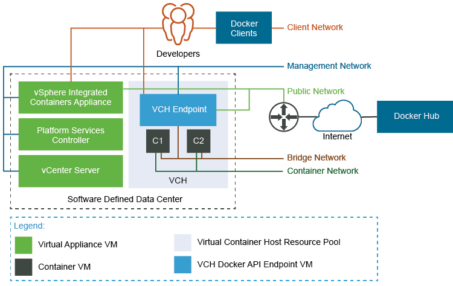
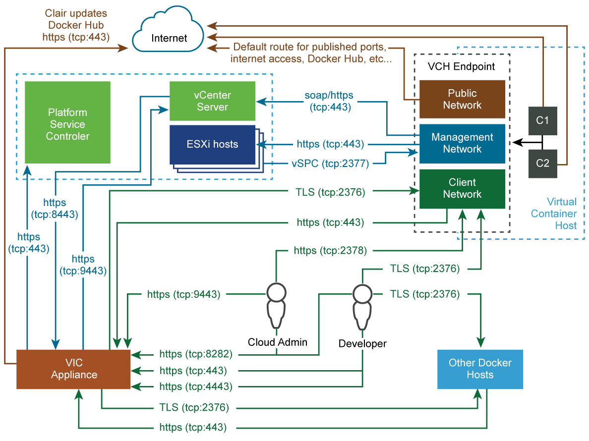

# Networking Requirements #

- [Appliance Networking Requirements](#networkreqs)
- [Understanding Docker and VCH Networking](#understanding)
- [Networking Requirements for VCH Deployment](#vchnetworkreqs)
  - [vSphere Port Groups](#portgroups)
  - [NSX Data Center for vSphere Logical Switches](#nsx)
  - [NSX-T Data Center Logical Switches](#nsxt)
- [VCH Networks](#vchnetworks)
  - [Bridge Networks](#bridge)
  - [Public Network](#public)
  - [Client and Management Networks](#client-mgmt)
  - [Container Networks](#container)
  - [Network Isolation](#isolation)
- [Ports and Protocols](#ports)

## Appliance Networking Requirements 

The vSphere Integrated Containers appliance requires access to the external Internet, the vSphere Infrastructure, and to the network on which developers connect Docker clients. You can deploy the vSphere Integrated Containers appliance to a standard network, an NSX Data Center for vSphere network, or to an NSX-T Data Center network.

## Understanding Docker and VCH Networking 

To understand how you can configure networks on VCHs, you first must understand how networking works in Docker.

For an overview of Docker networking in general, and an overview of networking with vSphere Integrated Containers in particular, watch the Docker Networking Options and vSphere Integrated Containers Networking Overview videos on the [VMware Cloud-Native YouTube Channel](https://www.youtube.com/channel/UCdkGV51Nu0unDNT58bHt9bg):

<table>
				<tbody>
					<tr>
						<td><!--StartFragment-->{{ 'https://www.youtube.com/watch?v=Yr6-2ddhLVo' | noembed }}<!--EndFragment--></td>
						<td><!--StartFragment-->{{ 'https://www.youtube.com/watch?v=QLi9KasWLCM' | noembed }}<!--EndFragment--></td>
					</tr>
				</tbody>
			</table>

See also [Docker container networking](https://docs.docker.com/engine/userguide/networking/) in the Docker documentation.

## Networking Requirements for VCH Deployment 

VCHs connect to multiple different networks, as shown in the image below.

Each VCH requires an IPv4 address on each of the network interfaces that it is connected to. The bridge network is handled internally, but other interfaces must have a static IP configured on them, or be able to acquire one via DHCP. 

Network interfaces for VCHs can be of the following types:

- Standard vSphere port groups that you create on vSphere Distributed Switches
- NSX Data Center for vSphere logical switches
- NSX-T Data Center logical switches. 

You must create port groups or logical switches in the vSphere Client, NSX Manager, or NSX-T Manager before you deploy a VCH. If you use NSX Data Center for vSphere or NSX-T Data Center logical switches, these logical switches must be available in the vCenter Server instance on which you deploy the VCHs.

You can use a mixture of port groups, NSX Data Center for vSphere logical switches, and NSX-T Data Center logical switches for the different VCH networks.

### vSphere Port Groups 

For information about how to create vSphere Distributed Switches and port groups, and how to add hosts to the vSphere Distributed Switches, see the following topics in the vSphere documentation:

- [Create a vSphere Distributed Switch](https://docs.vmware.com/en/VMware-vSphere/6.7/com.vmware.vsphere.networking.doc/GUID-D21B3241-0AC9-437C-80B1-0C8043CC1D7D.html) 
- [Add Hosts to a vSphere Distributed Switch](https://docs.vmware.com/en/VMware-vSphere/6.7/com.vmware.vsphere.networking.doc/GUID-E90C1B0D-82CB-4A3D-BE1B-0FDCD6575725.html)

### NSX Data Center for vSphere Logical Switches 

You make NSX Data Center for vSphere logical switches available to vCenter Server by registering vCenter Server with NSX Manager. For information about how to regster vCenter Server with NSX Manager, prepare hosts and clusters, and how to create logical switches, see the following sections in the NSX Data Center for vSphere documentation: 

- [NSX Data Center for vSphere Installation Guide](https://docs.vmware.com/en/VMware-NSX-Data-Center-for-vSphere/6.4/com.vmware.nsx.install.doc/GUID-D8578F6E-A40C-493A-9B43-877C2B75ED52.html)
- [Add a Logical Switch](https://docs.vmware.com/en/VMware-NSX-Data-Center-for-vSphere/6.4/com.vmware.nsx.install.doc/GUID-DD31D6BC-2E56-4E91-B45F-FCA3E80FF786.html)

### NSX-T Data Center Logical Switches 

You make NSX-T Data Center logical switches available to vCenter Server by adding the hosts or clusters that vCenter Server manages to the management plane in NSX-T Manager. For information about how to add hosts or clusters to the management plane and create NSX-T Data Center logical switches, see the following sections in the NSX-T Data Center documentation: 

- [NSX-T Data Center Installation Guide](https://docs.vmware.com/en/VMware-NSX-T-Data-Center/2.3/com.vmware.nsxt.install.doc/GUID-3E0C4CEC-D593-4395-84C4-150CD6285963.html)
- [Create a Logical Switch
](https://docs.vmware.com/en/VMware-NSX-T-Data-Center/2.3/com.vmware.nsxt.admin.doc/GUID-23194F9A-416A-40EA-B9F7-346B391C3EF8.html) 

**NOTE**: If you use NSX-T Data Center logical switches, it is not mandatory for T1 or T0 routers to be present. The bridge network  does not use layer 3, so does not require T1 and T0 routers. For container networks, if you need to access container VMs externally, you might need a T1 router to bridge overlay and underlay networks. If you only want to validate connections to container VMs via the container network, you do not require T1 and T0 routers.

## VCH Networks 

You can direct traffic between containers, the VCH, the external Internet, and your vSphere environment to different networks. Some networks require a dedicated interface. Other networks can share an interface.

**IMPORTANT**: 

- If you configure a VCH to use different interfaces for each of the public, management, and client networks, these networks must all be accessible by the vSphere Integrated Containers appliance. 
- All of the hosts in a cluster should be attached to the port groups or logical switches that you create for the VCH networks and for any mapped container networks.

### Bridge Networks 

Each VCH requires a unique interface for use as the bridge network. You cannot share this interface between multiple VCHs. When deploying VCHs directly to ESXi Server hosts, by default `vic-machine` creates a port group for the bridge network. When deploying VCHs to vCenter Server, you must create an interface for use as the bridge network before you deploy the VCH.
 
If you use standard networks, create a VMware vSphere Distributed Switch, and create a dedicated port group for use as the bridge network for each VCH. You can create multiple port groups on the same switch, but each VCH requires its own unique port group for the bridge network. 

If you use NSX Datacenter for vSphere or NSX-T Data Center networks, create a logical switch for use as the bridge network for each VCH. Each VCH requires its own unique logical switch for the bridge network. 

For information about bridge networks, see [Configure Bridge Networks](bridge_network.md).

### Public Network 

Each VCH requires access to at least one network interface for use as the public network. The public network is the network over which VCHs connect to the Internet, so it must have external Internet access. You can share this interface between multiple VCHs. The public network does not need to be trusted.

Create either a standard vSphere port group or an NSX Datacenter for vSphere or NSX-T Data Center logical switch for use as the VCH public network. The VCH endpoint VM must be able to obtain an IP address on this interface. You can use the same interface as the public network for multiple VCHs. You cannot use the same interface for the public network as you use for the bridge network.

- If you use the Create Virtual Container Host wizard to create VCHs, it is **mandatory** to use a dedicated interface for the public network.
- If you use `vic-machine` to deploy VCHs, by default the VCH uses the VM Network, if present, for the public network. If the VM Network is present, it is therefore not mandatory to use a dedicated interface for the public network, but it is strongly recommended. Using the default VM Network for the public network instead of a dedicated interface prevents vSphere vMotion from moving the VCH endpoint VM between hosts in a cluster. If the VM Network is not present, you must create an interface for the public network.
  
You can share the public network interface with the client and management networks. For information about VCH public networks, see [Configure the Public Network](public_network.md).

### Client and Management Networks 

Optionally create either a standard vSphere port group or an NSX Datacenter for vSphere or NSX-T Data Center logical switch for each of the management and client networks. You can use the same interface as the management and client network for multiple VCHs. Use a trusted network for the management network. Connections between Docker clients and the VCH are encrypted via TLS unless you explicitly disable TLS. The client network does not need to be trusted.

For information about VCH client and management networks, see [Configure the Client Network](client_network.md) and [Configure the Management Network](mgmt_network.md).

### Container Networks 

Optionally create standard vSphere port groups or NSX Datacenter for vSphere or NSX-T Data Center logical switches for use as mapped container networks. For information about container networks, see [Configure Container Networks](container_networks.md). 

### Network Isolation 
 
Isolate the bridge network and any mapped container networks. If you use standard networks, you can isolate networks by using a separate VLAN for each network. For information about how to assign a VLAN ID to a port group, see [VMware KB 1003825](https://kb.vmware.com/kb/1003825). For more information about private VLAN, see [VMware KB 1010691](https://kb.vmware.com/kb/1010691).

If you use NSX Data Center for vSphere or NSX-T Data Center logical switches for the bridge and container networks, these networks are isolated by default.

## Ports and Protocols 

The image below shows detailed information how different entities that are part of a vSphere Integrated Containers environment communicate with each other. 

 