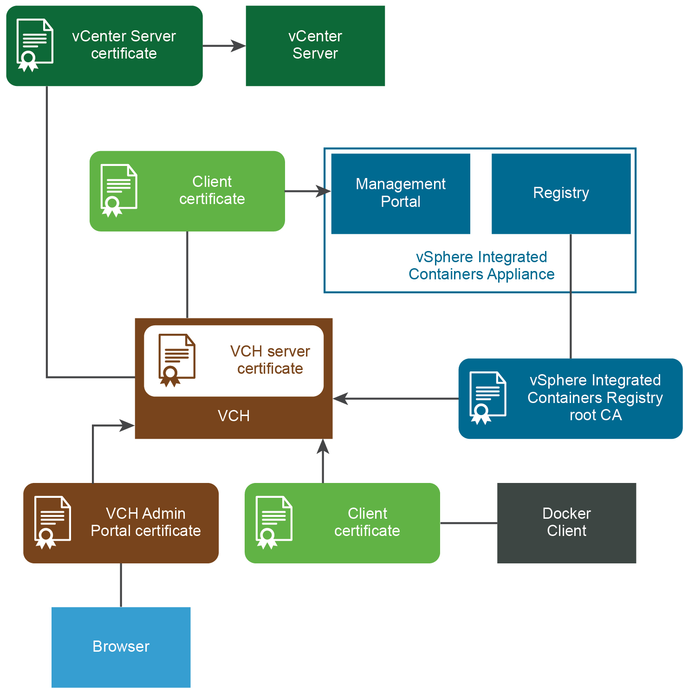

# Virtual Container Host Certificate Requirements #

Virtual container hosts (VCHs) authenticate connections from Docker API clients and vSphere Integrated Containers Management Portal by using server and client TLS certificates. This configuration is commonly referred to as `tlsverify` in documentation about containers and Docker. 

**IMPORTANT**: The certificate requirements for VCHs and for the vSphere Integrated Containers appliance are different. For information about how the appliance uses certificates, see [vSphere Integrated Containers Appliance Certificate Requirements](appliance_cert_reqs.md).

## Certificate Usage in Docker 

There are four certificates in use in a Docker `tlsverify` configuration:

- **(1)** A client certificate, held by the Docker client.
- **(2)** A server certificate, held by the server, which in a VCH is the Docker API endpoint.
- **(3)** A certificate authority (CA), that signs the server certificate.
- **(4)** Another CA, that signs the client certificate and is held by the server.

When using the Docker client, the client validates the server either by using CAs that are present in the root certificate bundle of the client system, or that container developers provide explicitly by using the `--tlscacert` option when they run Docker commands. As a part of this validation, the Common Name (CN) in the server certificate must match the name or address of the system from which the Docker client accesses the server. The server certificate must explicitly state at least one of the following in the CN:

- The FQDN of the system from which the Docker client communicates with the server
- The IP address of the system from which the Docker client communicates  with the server
- A wildcard domain that matches all of the FQDNs in a specific subdomain 

If the server certificate includes a wildcard domain, all of the systems in that domain can connect to the server. For an example of a domain wildcard, see [https://en.wikipedia.org/wiki/Wildcard_certificate#Example](https://en.wikipedia.org/wiki/Wildcard_certificate#Example).

Docker clients search for certificates in the `DOCKER_CERT_PATH` location on the system on which the Docker client is running. Docker requires certificate files to have the following names if they are to be  consumed automatically from `DOCKER_CERT_PATH`:

|**File Name**|**Description**|
|---|---|
|`cert.pem`, `key.pem`|Client certificate **(1)** and private key.|
|`server-cert.pem`, `server-key.pem`|Server certificate **(2)**|
|`ca.pem`|Public portion of the certificate authority that signed the server certificate **(3)**. Allows the server to confirm that a client is authorized.|

## Certificate Usage in VCHs 

When you deploy a VCH, you specify the level of security to apply to connections from Docker clients or vSphere Integrated Containers Management Portal to the Docker API endpoint in the VCH. You can set the following  levels of security:

|**Option**|**Security Level**|**Encrypted Communication**|
|---|---|---|
|Client-server authentication|Only verified clients can connect to VCH|Yes|
|Server authentication|Any client can connect to VCH|Yes|
|No authentication|Insecure|No|

As a convenience, vSphere Integrated Containers Engine can optionally generate client **(1)** and server **(2)** certificates. It can also  automatically generate one CA that signs both the server certificate **(3)** and signs the client certificate **(4)**. If you use an automatically generated CA, vSphere Integrated Containers Engine uses that CA to sign both of the client and server certificates. This means that you must provide the `cert.pem`, `key.pem`, and `ca.pem` client certificate files to all container developers who need to connect Docker clients to the VCHs. If the VCH implements client authentication, you must also provide the contents of client certificate files to vSphere Integrated Containers Management Portal if you register the VCH in a project. 

Rather than using an automatically generated CA, in a production deployment you would normally use custom CAs. In this case:

- The CA that signs the server certificate **(3)** is usually signed by a company certificate that is rooted by a public or corporate trust authority, for example Verisign. 
- The CA that signs the client certificate **(4)** can be unique per client or group of clients. Using the same CA for a group of clients allows each client to have a unique certificate, but allows the group to be authorized as a whole. For example, you could use one CA per VCH, multiple CAs per VCH, or one CA per group of VCHs.

This diagram shows how VCHs use certificates to authenticate connections between the different components in a vSphere Integrated Containers environment. The diagram shows a deployment in which verification of client certificates is enabled on virtual container hosts (VCHs).

If you implement client authentication, you must distribute client certificates to container developers or DevOps administrators so that they can configure their Docker clients and vSphere Integrated Containers Management Portal to connect to the VCH. 

- For information about how to provide client certificates to Docker clients, see [Configure the Docker Client for Use with vSphere Integrated Containers](../vic_app_dev/configure_docker_client.md).
- For information about how to provide client certificates to vSphere Integrated Containers Management Portal, see [Add Container Hosts with Full TLS Authentication](../vic_cloud_admin/add_vch_fullTLS_in_portal.md) in *vSphere Integrated Containers Management Portal Administration*.

### Automatically Generated Certificates 

vSphere Integrated Containers Engine provides the option of automatically generating server and client certificates when you deploy a VCH. The generated certificates are functional, but they do not allow for fine control over aspects such as expiration, intermediate certificate authorities, and so on. To use more finely configured certificates, use custom certificates. 

### Custom Certificates 

To exercise fine control over the certificates that VCHs use, you must obtain or generate custom certificates yourself before you deploy a VCH. You can create a VCH that uses a custom server certificate, for example a server certificate that has been signed by Verisign or another public root. For information about how to create custom certificates for use with Docker, see [Protect the Docker daemon socket](https://docs.docker.com/engine/security/https/) in the Docker documentation. 

You can deploy a VCH to use custom certificates in combination with auto-generated certificates, as demonstrated in the VCH security [Examples](vch_cert_options.md#examples). 

The table below shows the certificate formats that VCHs support, and the required components.

|**Certificate Format**|**Required Components**|
|---|---|
|PKCS#12|End-entity (leaf) certificate, CA chain certificate, private key in PKCS#8 format|
|PKCS#7|End-entity certificate, private key in PKCS#8 format|
|RSA/PKCS#1|Private key in PKCS#8 format|

**IMPORTANT**: PKCS#7 certificate keys do not work with `vic-machine`. For information about how to convert certificate keys to the correct format, see [Converting PKCS#7 Certificates for Use with VCHs](appliance_cert_reqs.md#convertcerts).

### Converting PKCS#7 Certificate Keys for Use with VCHs 

VCHs do not support PKCS#7 certificate keys. You must convert PCKS#7 keys to PKCS#8 format before you can use them with VCHs.

To unwrap a PKCS#7 key for use with a VCH, run the following command: <pre>$ openssl pkcs7 -print_certs -in <i>cert_name</i>.pem -out chain.pem</pre>

## VCH Server Certificate 

The VCH server certificate validates connections to the Docker API that runs in the VCH endpoint VM. The server certificate can be automatically generated, or you can provide a custom certificate. 

The VCH validates the incoming client certificate by verifying the CA that signed the client certificate. The VCH uses its automatically generated CA or a CA that you upload when you deploy  the VCH.

#### Automatically Generated Server Certificate 

You can automatically generate a server certificate for the Docker API endpoint in the VCH. 

You can download the automatically generated server certificate for a VCH from the vSphere Client. For information about downloading server certificates, see [View All VCH and Container Information in the HTML5 vSphere Client](access_h5_ui.md).

For information about how to automatically generate a server certificate during VCH deployment, see the section [Server Certificates](vch_cert_options.md#server) in *Virtual Container Host Certificate Options*.

#### Custom Server Certificate 

Custom server certificates for VCHs must meet the following requirements:

- You must use an X.509 server certificate.
- The Common Name (CN) in the server certificate must match the FQDN or IP address of the system from which the Docker client accesses the server, or a wildcard domain that matches all of the FQDNs in a specific subdomain.
- Server certificates must have the following certificate usages:
  - `KeyEncipherment`
  - `DigitalSignature`
  - `KeyAgreement`
  - `ServerAuth`
- Server keys must not be encrypted. 

If you use certificates that are not signed by a trusted certificate authority, container developers might require the server certificate when they run Docker commands in `--tlsverify` client mode. You can download the server certificate for a VCH from the vSphere Client. For information about downloading server certificates, see [View All VCH and Container Information in the HTML5 vSphere Client](access_h5_ui.md).

## VCH Client Certificate 

vSphere Integrated Containers Management Portal uses a client certificate to authenticate with the VCH when you add it to a project.

Docker client uses a client certificate to authenticate connections to the VCH.

### Automatically Generated Client Certificate 

VCHs accept client certificates if they are signed by a CA. You can optionally provide a custom CA to the VCH. Alternatively, you can configure a VCH so that vSphere Integrated Containers Engine creates an automatically generated CA. vSphere Integrated Containers Engine uses the CA to automatically generate and sign a single client certificate. 

For information about how to automatically generate a client certificate during VCH deployment, see the section [Client Certificates](vch_cert_options.md#client) in *Virtual Container Host Certificate Options*.

**NOTE**: The Create Virtual Container Host wizard in the vSphere Client does not support automatically generated CA or client certificates. To use automatically generated CA and client certificates, you must use the `vic-machine` CLI utility to create the VCH.

### Custom Client Certificate 

For the VCH to trust the CA that you use to sign the client certificate, the client certificate must include the following elements:

- The name or address of the system from which the Docker client accesses the server in the subject or subject alternative name. This can be an FQDN or a wildcard domain.
- Key usage in the v3 extensions that match the key usage chosen for the VCH server certificate:
  - `KeyEncipherment`
  - `KeyAgreement`
  - `clientAuth`

You cannot download client certificates for VCHs from the vSphere Client. vSphere administrators distribute client certificates directly.

## vSphere Integrated Containers Registry Root CA 

VCH requires registry root CA to pull images from vSphere Integrated Containers Registry

Docker Engine requires registry root CA to push and pull images to and from vSphere Integrated Containers Registry

- **Type**: Self-signed
- **Format**: Auto-generated `*.pem` file
- **Used by**: Management Portal administrators, DevOps admininistrators, developers

Authenticates connections to vSphere Integrated Containers Registry instances from VCHs, Docker clients, replication of projects between registry instances, and registration of additional registry instances in the management portal. For information about how to obtain the registry certificate, see [Configure System Settings](../vic_cloud_admin/configure_system.md).

## vCenter Server or ESXi Host Certificate 

VCHs verify vCenter Server certificates or ESXi host certificates during deployment and when they perform operations in the virtual infrastructure.

- **Type**: Self-signed or custom
- **Format**: See [vSphere Security Certificates](https://docs.vmware.com/en/VMware-vSphere/6.7/com.vmware.psc.doc/GUID-779A011D-B2DD-49BE-B0B9-6D73ECF99864.html) in the vSphere documentation
- **Used by**: vSphere administrator

Required for installation of the vSphere Client plug-ins and deployment and management of virtual container hosts (VCHs). See [Obtain vSphere Certificate Thumbprints](obtain_thumbprint.md).

## VCH Administration Portal Certificate 

Browsers can use the VCH Admin Portal certificate to authenticate access VCH Admin Portal.

- **Type**: None, self-signed, or custom
- **Format**: `*.pfx`
- **Used by**: vSphere administrators

If you deploy a VCH with client and server authentication, vSphere Integrated Containers Engine generates a *.pfx certificate that you can use to authenticate connections to with the VCH Admin portal. See [VCH Administration Portal](access_vicadmin.md).