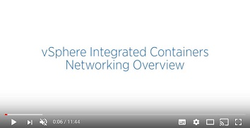

# Virtual Container Host Networking #

You can configure networks on a virtual container host (VCH) that are tied into the vSphere infrastructure. You define which networks are available to a VCH when you deploy the VCH.

Each network that a VCH uses is a port group on either a vCenter Server instance or ESXi host. You can deploy VCHs on NSX networks.

The image below shows a high-level view of the networks that a VCH uses and how they connect to your vSphere environment, to vSphere Integrated Containers Registry and Management Portal, and to the Docker environment. 
 
 

The following sections describe each of the VCH network types.

**IMPORTANT**: A VCH supports a maximum of 3 distinct network interfaces. The bridge network requires its own port group, at least two of the public, client, and management networks must share a network interface and therefore a port group. Container networks do not go through the VCH, so they are not subject to this limitation. This limitation will be removed in a future release

## Useful Resources

- See [Docker container networking](https://docs.docker.com/engine/userguide/networking/) in the Docker documentation.
- Watch the Docker Networking Options and vSphere Integrated Containers Networking Overview videos on the VMware Cloud-Native YouTube Channel:

      

## `vic-machine` Networking Options 

The `vic-machine create` utility allows you to specify different networks for the different types of traffic between containers, the VCH, the external internet, and your vSphere environment.

By default, `vic-machine create` obtains IP addresses for VCH endpoint VMs by using DHCP. For information about how to specify a static IP address for the VCH endpoint VM on the client, public, and management networks, see [Specify a Static IP Address for the VCH Endpoint VM](#static-ip) in Advanced Options.

If your network access is controlled by a proxy server, see  in Advanced Options. 

When you specify different network interfaces for the different types of traffic, `vic-machine create` checks that the firewalls on the ESXi hosts allow connections to port 2377 from those networks. If access to port 2377 on one or more ESXi hosts is subject to IP address restrictions, and if those restrictions block access to the network interfaces that you specify, `vic-machine create` fails with a firewall configuration error:
<pre>Firewall configuration incorrect due to allowed IP restrictions on hosts: 
"/ha-datacenter/host/localhost.localdomain/localhost.localdomain" 
Firewall must permit dst 2377/tcp outbound to the VCH management interface
</pre>

For information about how to open port 2377, see [Open the Required Ports on ESXi Hosts](open_ports_on_hosts.md).

In addition to the mandatory bridge network, if your vCenter Server environment includes multiple networks, you can direct different types of traffic to different networks. 

- [Management Network](management_network.md)
- [Public Network](public_network.md)
- [Client Network](client_network.md)
- [Bridge Network](bridge_network.md)
- [Container Networks](container_networks.md)
- [Specify a Static IP Address for the VCH Endpoint VM](vch_static_ip.md)
- [Configure VCHs to Use Proxy Servers](vch_proxy.md)