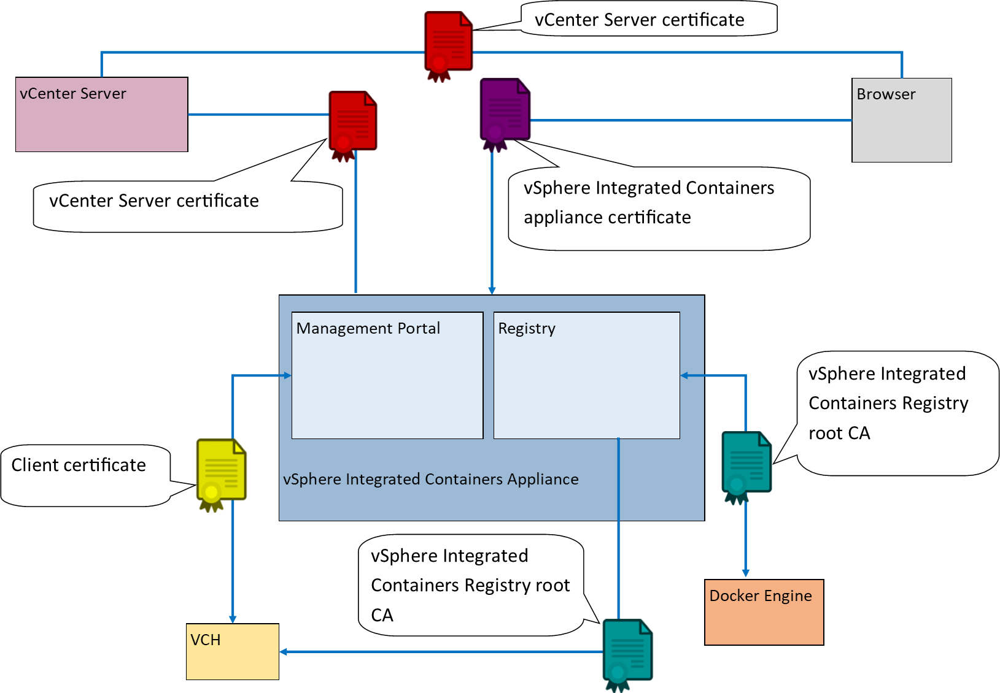

# vSphere Integrated Containers Appliance Certificate Requirements #

vSphere Integrated Containers authenticates connections between its various components by using TLS certificates. In some cases, the certificates are always automatically generated and self-signed. In other cases, you have the option of providing custom certificates. 

**IMPORTANT**: The certificate requirements for the appliance and for virtual container hosts (VCHs) are different. For information about how VCHs use certificates, see [Virtual Container Host Certificate Requirements](vch_cert_reqs.md). 

- [Overview of vSphere Integrated Containers Certificate Use](#overview)
- [About TLS Certificates](#about_tls)
- [vCenter Server or ESXi Host Certificate](#vcenter)
- [vSphere Integrated Containers Appliance Certificate](#appliance)
  - [Use a Certificate with an Intermediate CA for the vSphere Integrated Containers Appliance](#intermediateca)
- [vSphere Integrated Containers Registry Root CA](#registry)

## Overview of vSphere Integrated Containers Appliance Certificate Use <a id="overview"></a>

This diagram shows how the vSphere Integrated Containers appliance uses certificates to authenticate connections between the different components. The diagram shows a deployment in which verification of client certificates is enabled on virtual container hosts (VCHs).



## About TLS Certificates <a id="about_tls"></a>

A certificate is made up of two parts:

- A public certificate part, that is distributed to anyone who needs it
- A private key part, that is kept secret

Paired certificate and key files follow general naming conventions:

- `cert.pem` and `key.pem`
- `<prefix>.pem` and `<prefix>-key.pem`
- `<prefix>-cert.pem` and `<prefix>-key.pem`

For general information about TLS certificates, see https://en.wikipedia.org/wiki/Transport_Layer_Security.

## vCenter Server or ESXi Host Certificate <a id="vcenter"></a>

- **Type**: Self-signed or custom
- **Format**: See [vSphere Security Certificates](https://docs.vmware.com/en/VMware-vSphere/6.7/com.vmware.psc.doc/GUID-779A011D-B2DD-49BE-B0B9-6D73ECF99864.html) in the vSphere documentation
- **Used by**: vSphere administrator

Required for installation of the vSphere Client plug-ins and deployment and management of virtual container hosts (VCHs). See [Obtain vSphere Certificate Thumbprints](obtain_thumbprint.md).

## vSphere Integrated Containers Appliance Certificate <a id="appliance"></a>

- **Type**: Self-signed or custom
- **Format**: Supports unencrypted PEM encoded PKCS#1 and unencrypted PEM encoded PKCS#8 formats for TLS private keys. If you provide a PKCS#1 format certificate, vSphere Integrated Containers converts it to PKCS8 format.
- **Used by**: vSphere administrator, Management Portal administrators,  DevOps admininistrators, developers

Authenticates connections from browsers to vSphere Integrated Containers Management Portal, the Getting Started page, downloads of vSphere Integrated Containers Engine binaries, and the installation of vSphere Client plug-ins. Also authenticates the Management Portal, Registry, and file server connections with vCenter Server during initialization of the appliance.

For information about where to obtain auto-generated appliance certificates after deployment, see [Obtain the Thumbprints and CA Files of the vSphere Integrated Containers Appliance Certificates](obtain_appliance_certs.md) and [Verify and Trust vSphere Integrated Containers Appliance Certificates](../vic_cloud_admin/trust_vic_certs.md).

### Use a Certificate with an Intermediate CA for the vSphere Integrated Containers Appliance <a id="intermediateca"></a>

When you deploy the vSphere Integrated Containers appliance, you can  specify a certificate with an intermediate certificate authority (CA) as the appliance certificate. 

**Procedure**

1. Create a certificate chain PEM file, that goes all the way down to the root CA.
2. Follow the instructions in [Deploy the vSphere Integrated Containers Appliance](deploy_vic_appliance.md) to start the deployment of the appliance.
3. At the Customize Template page of the deployment wizard, paste the contents of the certificate chain PEM file into the **Appliance TLS Certificate** text box. 

    A certificate with an intermediate CA looks something like this:

    ```
    -----BEGIN CERTIFICATE-----
    <VIC appliance server certificate>
    -----END CERTIFICATE-----
    -----BEGIN CERTIFICATE-----
    <intermediate CA certificate>
    -----END CERTIFICATE-----
    -----BEGIN CERTIFICATE-----
    <root certificate>
    -----END CERTIFICATE-----
    ```
4. Paste the contents of the unencrypted PEM encoded PKCS1 or PKCS8 format private key into the **Appliance TLS Certificate Key** text box.
5. Paste the contents of the root CA certificate into the **Certificate Authority Certificate** text box.
6. Continue with the procedure in [Deploy the vSphere Integrated Containers Appliance](deploy_vic_appliance.md#step4).

## vSphere Integrated Containers Registry Root CA <a id="registry"></a>

- **Type**: Self-signed
- **Format**: Auto-generated `*.pem` file
- **Used by**: Management Portal administrators, DevOps admininistrators, developers

Authenticates connections to vSphere Integrated Containers Registry instances from VCHs, Docker clients, replication of projects between registry instances, and registration of additional registry instances in the management portal. For information about how to obtain the registry certificate, see [Configure System Settings](../vic_cloud_admin/configure_system.md).