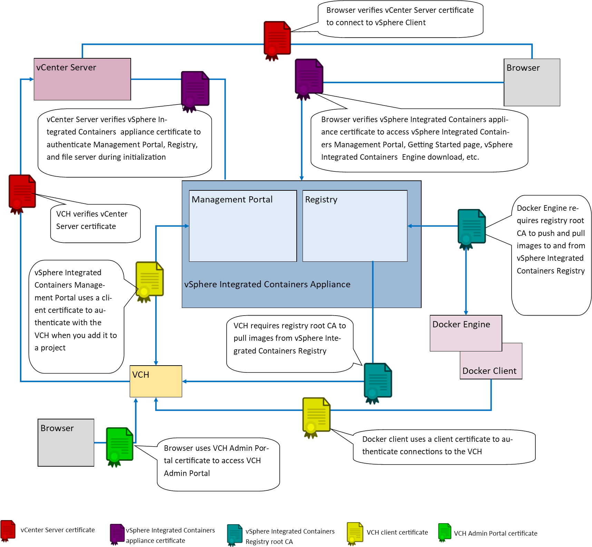
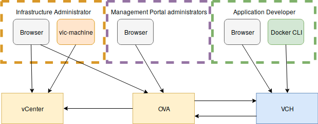

# Certificate Requirements #

* [About TLS Certificates and Docker](tls_docker_certs.md)
* [Appliance Certificate Requirements](appliance_cert_reqs.md) 
* [VCH Certificate Requirements](vch_cert_reqs.md)
* [vSphere Integrated Containers Registry Root CA](registry_cert.md)

This diagram shows how the vSphere Integrated Containers appliance and VCHs use certificates to authenticate connections between the different components. The diagram shows a deployment in which verification of client certificates is enabled on virtual container hosts (VCHs).

This diagram shows the certificates that are required and used by the different types of vSphere Integrated Containers users.

