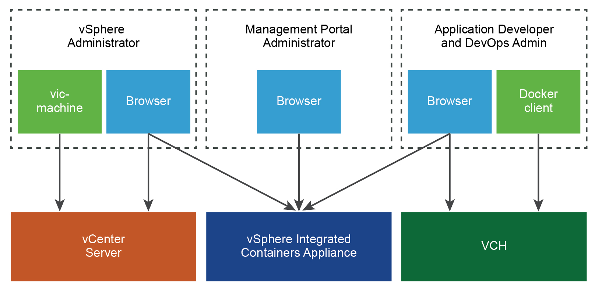

# vSphere Integrated Containers Certificate Requirements #

vSphere Integrated Containers secures the connections between its different components, with the vSphere infrastructure, and with the Docker development environment by using TLS certificates. 

The different components have different certificate requirements. You can opt for vSphere Integrated Containers to automatically generate all of the required certificates. Alternatively, you can upload your own custom certificates during the deployment of the vSphere Integrated Containers appliance and virtual container hosts (VCHs). If you use custom certificates for any of the components, these certificates must exist before deployment, and must meet certain criteria.

This diagram shows a simplified view of the certificates that are required and used by the different vSphere Integrated Containers components and their respective users.

For more information about appliance certificates, see [vSphere Integrated Containers Appliance Certificate Requirements](appliance_cert_reqs.md). For more information about VCH certificates, see [Virtual Container Host Certificate Requirements](vch_cert_reqs.md).

## About TLS Certificates 

A TLS certificate is made up of two parts:

- A public certificate part, that is distributed to anyone who needs it
- A private key part, that is kept secret

Paired certificate and key files follow general naming conventions:

- `cert.pem` and `key.pem`
- `<prefix>.pem` and `<prefix>-key.pem`
- `<prefix>-cert.pem` and `<prefix>-key.pem`

For general information about TLS certificates, see https://en.wikipedia.org/wiki/Transport_Layer_Security.