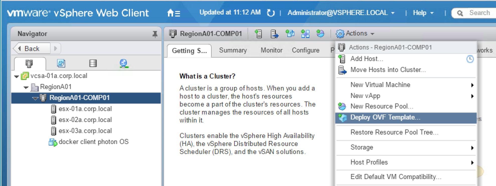

# Tutorial: VIC Installation


## Introduction

 

This blog covers VIC 1.2.1 Installation for lab or production environment.

Following aspects of the installation will be detailed in this tutorial:

* VIC – Product versions & Pre-Requisites
* VIC - Deployment Options
* VIC – Installation and Consumption
* Install VIC appliance (by deploying VIC OVA)
* Provision a VCH Instance
* Delete a VCH Instance

---


## Terminology


VIC uses several terminologies which are important to understand from the beginning.

**VIC appliance** (vSphere Integrated Container) will be deployed as a VM from an OVA.
VIC appliance will host essentials services like the Harbor private registry and Admiral container management.
VIC appliance will host also the vic-machine utility that enables administrators to deploy **VCH** (Virtual Container Hosts).

VCH will be instantiated as a VM under an automatically created resource pool in the Compute cluster.
VCH behaves as a Docker endpoint where developer can target their system to in order to run Containers as VM (C-VM) on the ESXi cluster, up to the limit imposed by the resource pool.

Multiple VCH Instances can be deployed in the same vSphere environment.

---


## VIC – Product versions & Pre-Requisites

 

__Product versions__:

* ESXi: 6.0 or 6.5 (6.5 recommended)
* vCenter: 6.0 or 6.5 (6.5 recommended)
* VIC: 1.2.1

ESXi, vCenter and VIC are all available for download on vmware.com.

In term of storage, VIC can operate with any type of datastore: VMFS, shared storage like NFS or iSCSI and vSAN.

 

 

__Environment Pre-Requisites__:

* vSphere Enterprise Plus License
* User with administrative credentials to vCenter
* At least one Compute cluster with DRS enabled
* Internet Access for VCH to download images from Docker Hub
* Shared datastores to store VCH and containers (recommended minimum of 200Gb)
* Allow communication on port 443 and 2377 between VCH and ESXi hosts
* VCH needs to be reachable by Docker users for containers creation
* VIC VM needs to be reachable by any admin user who needs to download the vic-machine utility
* VIC VM needs to be reachable by Docker users for image upload and download (VIC VM hosts container registry)
* VIC VM needs to be reachable by VCH for container instantiation using a local image
* DVS switch with at least 2 Port Groups:
        1 for for public communication (VCH to external world)
        1 for for inter containers communication (recommended dedicated port group for each VCH)
        Note: If DHCP is not available on these segments, please, request a range of free IP Addresses.

 

DVS configuration used for this lab looks like this:


VM-RegionA01-vDS-COMP Port-Group will be used for public communication (to connect VCH to external world). 
This Port-Group hosts a DHCP server that will dynamically allocate IP address to VCH.

Bridge01-RegionA01-vDS-COMP will be used for inter containers communication.


---


# VIC  Deployment Options


## __Option 1__:

 
 2 types of cluster will be deployed:
 * Management Cluster: hosts management plane components (like vCenter and VIC VM).
 * Compute Cluster: hosts compute workloads (especially VCH – Virtual Container Host and Containers as VM).
 
 DVS switch will be used as virtual networking component to switch C-VM (Container as VM) and VCH traffic.
 DRS and HA will be activated on these clusters.
 
 
## __Option 2__:

 
 2 types of cluster will be deployed:
 * Management Cluster: hosts management plane components (like vCenter and VIC VM).
 * Compute Cluster: hosts compute workloads (especially VCH – Virtual Container Host and Containers as VM).
 
 NSX will be used as virtual networking component to switch C-VM (Container as VM) and VCH traffic.
 DRS and HA will be activated on these clusters.
 
 
## __Option 3__:
 
 
 1 type of cluster will be deployed:
 * Collapsed Compute & Management Cluster:
  hosts management plane components (like vCenter and VIC VM).
  hosts compute workloads (especially VCH – Virtual Container Host and Containers as VM).
 
 DVS switch will be used as virtual networking component to switch C-VM (Container as VM) and VCH traffic.
 DRS and HA will be activated on the collapsed cluster.


 For the purpose of this blog, we are going to use option 3 as deployment example.


---


# VIC – Installation and Consumption


## __Install VIC appliance (by deploying VIC OVA)__

 

Download VIC 1.2.1 from vmware.com (file should be named 'vic-v1.2.1-4104e5f9.ova')

on vCenter, select the compute cluster → Actions → Deploy OVF Template:


 
Note: as you can see on this ESXi cluster, we have already deployed a VM named 'docker client photon OS'.
This VM is intended to run the vic-machine utility and to run docker commands against VCH.

 

Select Local file and click on Browse. Select the VIC OVA from the local directory:


 
Click on Next.


Rename the VIC VM if needed:


 
Click on Next.

 
Select the cluster where VIC VM will be installed:


 
Click on Next.

 
Review details:


Click on Next.

 

Accept license agreements:


Click on Next.

 
Select disk format and datastore:


Click on Next.

 
Select networks Port-Group:


Click on Next.

 
Enter root password. Then, specify VIC VM network attributes:


Customize if needed parameters for Registry configuration:


Customize if needed parameters for Management Portal configuration:


Customize if needed parameters for File Server configuration:


Customize if needed parameters for Demo VCH installer wizard configuration:


Customize if needed parameters for Example Users configuration:


Click on Next.

 
Review all parameters:


Click on Finish to deploy VIC VM.

 
At the end of the deployment, you should be able to see VIC VM in the Hosts and Cluster frame as shown below:


Power on the VM. The console window of the VM should display this output:


Open a web browser and go to the URL https://<VIC VM IP>:9443 (https://192.168.100.21:9443/ for this lab)

 
The following window will appear. Fill the fields (vCenter information and credentials) as required:


Click on Continue.

 
A message will appear with information about the installation:


Once completed, you should be able to see this window:


This confirms the installation of VIC is successful!


## __Download vic-machine utility__

 

On the VM dedicated to host the vic-machine utility (docker client photon OS VM in our case), create a directory for this purpose.

 
```
root@docker-client [ ~/ ]# mkdir -p DATA/VIC
root@docker-client [ ~/ ]# cd DATA/VIC
root@docker-client [ ~/DATA/VIC ]# pwd
/root/DATA/VIC
```

 


```
root@docker-client [ ~/DATA/VIC ]# wget https://192.168.100.21:9443/files/vic_1.2.1.tar.gz --no-check-certificate

root@docker-client [ ~/DATA/VIC ]# ls
vic_1.2.1.tar.gz
```
 

```
root@docker-client [ ~/DATA/VIC ]# gunzip vic_1.2.1.tar.gz
root@docker-client [ ~/DATA/VIC ]# tar xvf vic_1.2.1.tar
root@docker-client [ ~/DATA/VIC ]# ls
vic  vic_1.2.1.tar
```
 
```
root@docker-client [ ~/DATA/VIC ]# cd vic
root@docker-client [ ~/DATA/VIC/vic ]# ls
LICENSE        bootstrap.iso       vic-machine-linux        vic-ui-linux
README         ui                  vic-machine-windows.exe  vic-ui-windows.exe
appliance.iso  vic-machine-darwin  vic-ui-darwin
```
 

## __Update ESXi FW rules to allow VCH to communicate with ESXi hosts__:

 

Retrieve vCenter thumbprint:
(please refer to this link for more info: 
https://vmware.github.io/vic-product/assets/files/html/1.2/vic_vsphere_admin/obtain_thumbprint.html)

```
ssh root@<vCenter Server>
openssl x509 -in /etc/vmware-vpx/ssl/rui.crt -fingerprint -sha1 -noout
```
 

 

Update ESXi FW rules to allow VCH to communicate with ESXi hosts:

```
root@docker-client [ ~/DATA/VIC/vic ]# ./vic-machine-linux update firewall --target vcsa-01a.corp.local --user administrator@vsphere.local --password VMware1! --compute-resource RegionA01-COMP01  --allow --thumbprint F7:68:F0:93:F4:EC:B7:FE:C1:02:3F:F3:AB:62:1A:50:E8:9A:0E:85

    Oct 30 2017 20:11:10.527Z INFO  ### Updating Firewall ####
    Oct 30 2017 20:11:10.749Z INFO  Validating target
    Oct 30 2017 20:11:10.749Z INFO  Validating compute resource
    Oct 30 2017 20:11:10.776Z INFO
    Oct 30 2017 20:11:10.777Z WARN  ### WARNING ###
    Oct 30 2017 20:11:10.777Z WARN          This command modifies the host firewall on the target machine or cluster
    Oct 30 2017 20:11:10.777Z WARN          The ruleset "vSPC" will be enabled
    Oct 30 2017 20:11:10.777Z WARN          This allows all outbound TCP traffic from the target
    Oct 30 2017 20:11:10.778Z WARN          To undo this modification use --deny
    Oct 30 2017 20:11:10.778Z INFO
    Oct 30 2017 20:11:10.930Z INFO  Ruleset "vSPC" enabled on host "HostSystem:host-29 @ /RegionA01/host/RegionA01-COMP01/esx-01a.corp.local"
    Oct 30 2017 20:11:11.046Z INFO  Ruleset "vSPC" enabled on host "HostSystem:host-31 @ /RegionA01/host/RegionA01-COMP01/esx-02a.corp.local"
    Oct 30 2017 20:11:11.170Z INFO  Ruleset "vSPC" enabled on host "HostSystem:host-32 @ /RegionA01/host/RegionA01-COMP01/esx-03a.corp.local"
    Oct 30 2017 20:11:11.170Z INFO
    Oct 30 2017 20:11:11.170Z INFO  Firewall changes complete
    Oct 30 2017 20:11:11.171Z INFO  Command completed successfully
```

 
## __Provision a VCH Instance__:

 
VCH characteristics: [information for this lab, replace it by yours]

* target: vcsa-01a.corp.local
* public-network: VM-RegionA01-vDS-COMP (DHCP server is connected on this network)
* bridge-network: Bridge01-RegionA01-vDS-COMP
* container-network: Bridge01-RegionA01-vDS-COMP
* compute-resource: RegionA01-COMP01
* image-store: RegionA01-ISCSI01-COMP01
* volume-store: RegionA01-ISCSI01-COMP01
* insecure-registry: 192.168.100.21 (IP of VIC VM)

IP address for VCH VM will be dynamically allocated by DHCP server. If you want to statically assign IP address to VCH, use the additional options in the command below:

--public-network-ip 192.168.100.221/24 --public-network-gateway 192.168.100.1 --dns-server=192.168.110.10

 

```
root@docker-client [ ~/DATA/VIC/vic ]# ./vic-machine-linux create --target vcsa-01a.corp.local --user administrator@vsphere.local --password VMware1! --public-network VM-RegionA01-vDS-COMP --bridge-network Bridge01-RegionA01-vDS-COMP --container-network VM-RegionA01-vDS-COMP:routable --container-network-firewall VM-RegionA01-vDS-COMP:open --compute-resource RegionA01-COMP01 --image-store RegionA01-ISCSI01-COMP01 --volume-store RegionA01-ISCSI01-COMP01:default --insecure-registry 192.168.100.21 --no-tlsverify --force

    Oct 30 2017 20:18:46.466Z INFO  ### Installing VCH ####
    Oct 30 2017 20:18:46.466Z WARN  Using administrative user for VCH operation - use --ops-user to improve security (see -x for advanced help)
    Oct 30 2017 20:18:46.482Z INFO  Generating self-signed certificate/key pair - private key in virtual-container-host/server-key.pem
    Oct 30 2017 20:18:46.598Z WARN  Configuring without TLS verify - certificate-based authentication disabled
    Oct 30 2017 20:18:46.825Z INFO  Validating supplied configuration
    Oct 30 2017 20:18:47.000Z INFO  vDS configuration OK on "Bridge01-RegionA01-vDS-COMP"
    Oct 30 2017 20:18:47.016Z INFO  vDS configuration OK on "VM-RegionA01-vDS-COMP"
    Oct 30 2017 20:18:47.102Z INFO  Firewall status: ENABLED on "/RegionA01/host/RegionA01-COMP01/esx-01a.corp.local"
    Oct 30 2017 20:18:47.149Z INFO  Firewall status: ENABLED on "/RegionA01/host/RegionA01-COMP01/esx-02a.corp.local"
    Oct 30 2017 20:18:47.195Z INFO  Firewall status: ENABLED on "/RegionA01/host/RegionA01-COMP01/esx-03a.corp.local"
    Oct 30 2017 20:18:47.206Z INFO  Firewall configuration OK on hosts:
    Oct 30 2017 20:18:47.206Z INFO          "/RegionA01/host/RegionA01-COMP01/esx-01a.corp.local"
    Oct 30 2017 20:18:47.206Z INFO          "/RegionA01/host/RegionA01-COMP01/esx-02a.corp.local"
    Oct 30 2017 20:18:47.207Z INFO          "/RegionA01/host/RegionA01-COMP01/esx-03a.corp.local"
    Oct 30 2017 20:18:47.758Z INFO  License check OK on hosts:
    Oct 30 2017 20:18:47.758Z INFO    "/RegionA01/host/RegionA01-COMP01/esx-01a.corp.local"
    Oct 30 2017 20:18:47.758Z INFO    "/RegionA01/host/RegionA01-COMP01/esx-02a.corp.local"
    Oct 30 2017 20:18:47.758Z INFO    "/RegionA01/host/RegionA01-COMP01/esx-03a.corp.local"
    Oct 30 2017 20:18:47.769Z INFO  DRS check OK on:
    Oct 30 2017 20:18:47.770Z INFO    "/RegionA01/host/RegionA01-COMP01"
    Oct 30 2017 20:18:47.920Z INFO  Insecure registries = 192.168.100.21
    Oct 30 2017 20:18:47.991Z INFO
    Oct 30 2017 20:18:48.086Z INFO  Creating virtual app "virtual-container-host"
    Oct 30 2017 20:18:48.132Z INFO  Creating appliance on target
    Oct 30 2017 20:18:48.151Z INFO  Network role "client" is sharing NIC with "public"
    Oct 30 2017 20:18:48.151Z INFO  Network role "management" is sharing NIC with "public"
    Oct 30 2017 20:18:49.554Z INFO  Creating directory [RegionA01-ISCSI01-COMP01] VIC
    Oct 30 2017 20:18:49.572Z INFO  Datastore path is [RegionA01-ISCSI01-COMP01] VIC
    Oct 30 2017 20:18:50.236Z INFO  Uploading images for container
    Oct 30 2017 20:18:50.236Z INFO          "appliance.iso"
    Oct 30 2017 20:18:50.238Z INFO          "bootstrap.iso"
    Oct 30 2017 20:19:01.789Z INFO  Waiting for IP information
    Oct 30 2017 20:19:33.531Z INFO  Waiting for major appliance components to launch
    Oct 30 2017 20:19:33.623Z INFO  Obtained IP address for client interface: "192.168.100.180"
    Oct 30 2017 20:19:33.623Z INFO  Checking VCH connectivity with vSphere target
    Oct 30 2017 20:19:34.124Z INFO  vSphere API Test: https://vcsa-01a.corp.local vSphere API target responds as expected
    Oct 30 2017 20:19:39.371Z INFO  Initialization of appliance successful
    Oct 30 2017 20:19:39.371Z INFO
    Oct 30 2017 20:19:39.371Z INFO  VCH Admin Portal:
    Oct 30 2017 20:19:39.371Z INFO  https://192.168.100.180:2378
    Oct 30 2017 20:19:39.372Z INFO
    Oct 30 2017 20:19:39.372Z INFO  Published ports can be reached at:
    Oct 30 2017 20:19:39.372Z INFO  192.168.100.180
    Oct 30 2017 20:19:39.372Z INFO
    Oct 30 2017 20:19:39.373Z INFO  Docker environment variables:
    Oct 30 2017 20:19:39.373Z INFO  DOCKER_HOST=192.168.100.180:2376
    Oct 30 2017 20:19:39.395Z INFO
    Oct 30 2017 20:19:39.396Z INFO  Environment saved in virtual-container-host/virtual-container-host.env
    Oct 30 2017 20:19:39.396Z INFO
    Oct 30 2017 20:19:39.396Z INFO  Connect to docker:
    Oct 30 2017 20:19:39.397Z INFO  docker -H 192.168.100.180:2376 --tls info
    Oct 30 2017 20:19:39.397Z INFO  Installer completed successfully

 ```

on vCenter, you should be able to see a new resource pool created and under this resource pool, the VCH VM instance:


Note that VCH VM has 2 network connections:

* 1 for for public communication (VCH to external world) - Using VM-RegionA01-vDS-COMP port-group.
* 1 for for inter containers communication - Using Bridge01-RegionA01-vDS-COMP port-group.


## __Use VCH as Docker endpoint__:

 

Retrieve the IP of VCH (192.168.100.180 here).

 
Issue the following commands:

 
```
root@docker-client [ ~/DATA/VIC/vic ]# DOCKER_HOST=192.168.100.180
root@docker-client [ ~/DATA/VIC/vic ]# export DOCKER_HOST
```
 

```
root@docker-client [ ~/DATA/VIC/vic ]# docker --tls info

    Containers: 0
     Running: 0
     Paused: 0
     Stopped: 0
    Images: 0
    Server Version: v1.2.1-13858-c3db65f
    Storage Driver: vSphere Integrated Containers v1.2.1-13858-c3db65f Backend Engine
    VolumeStores: default
    vSphere Integrated Containers v1.2.1-13858-c3db65f Backend Engine: RUNNING
     VCH CPU limit: 9828 MHz
     VCH memory limit: 5.643 GiB
     VCH CPU usage: 3108 MHz
     VCH memory usage: 5.103 GiB
     VMware Product: VMware vCenter Server
     VMware OS: linux-x64
     VMware OS version: 6.5.0
     Insecure Registries: 192.168.100.21
     Registry Whitelist Mode: disabled.  All registry access allowed.
    Plugins:
     Volume: vsphere
     Network: routable bridge
    Swarm: inactive
    Operating System: linux-x64
    OSType: linux-x64
    Architecture: x86_64
    CPUs: 9828
    Total Memory: 5.643 GiB
    ID: vSphere Integrated Containers
    Docker Root Dir:
    Debug Mode (client): false
    Debug Mode (server): false
    Registry: registry.hub.docker.com
    Experimental: false
    Live Restore Enabled: false
```
 


## __Delete a VCH Instance__:

 

First list all VCH instances:


```
root@docker-client [ ~/DATA/VIC/vic ]# ./vic-machine-linux ls --target vcsa-01a.corp.local --user administrator@vsphere.local --password VMware1! --thumbprint F7:68:F0:93:F4:EC:B7:FE:C1:02:3F:F3:AB:62:1A:50:E8:9A:0E:85

    Oct 30 2017 20:33:39.297Z INFO  ### Listing VCHs ####
    Oct 30 2017 20:33:39.488Z INFO  Validating target

    ID            PATH                                              NAME                          VERSION                     UPGRADE STATUS
    vm-403        /RegionA01/host/RegionA01-COMP01/Resources        virtual-container-host        v1.2.1-13858-c3db65f        Up to date
```
 

Then delete the VCH instance using the VM ID:

```
root@docker-client [ ~/DATA/VIC/vic ]# ./vic-machine-linux delete --id vm-403 --target vcsa-01a.corp.local --user administrator@vsphere.local --password VMware1! --thumbprint F7:68:F0:93:F4:EC:B7:FE:C1:02:3F:F3:AB:62:1A:50:E8:9A:0E:85

    Oct 30 2017 20:34:48.509Z INFO  ### Removing VCH ####
    Oct 30 2017 20:34:48.686Z INFO  Validating target
    Oct 30 2017 20:34:48.787Z INFO
    Oct 30 2017 20:34:48.787Z INFO  VCH ID: VirtualMachine:vm-403
    Oct 30 2017 20:34:48.807Z INFO  Removing VMs
    Oct 30 2017 20:34:48.842Z INFO  Removing image stores
    Oct 30 2017 20:34:50.157Z WARN  Since --force was not specified, the following volume stores will not be removed. Use the vSphere UI or supplied nfs targets to delete content you do not wish to keep.
     vsphere volumestores:
            default: [RegionA01-ISCSI01-COMP01] VIC

     NFS volumestores:


    Oct 30 2017 20:34:50.157Z INFO  Removing appliance VM network devices
    Oct 30 2017 20:34:51.350Z INFO  Unregistered VM to cleanup after failed destroy: "VirtualMachine:vm-403"
    Oct 30 2017 20:34:52.323Z INFO  Removing Resource Pool "virtual-container-host"
    Oct 30 2017 20:34:52.365Z INFO  ----------
    Oct 30 2017 20:34:52.366Z INFO  If firewall changes were made for VIC during install, they were not reverted during delete
    Oct 30 2017 20:34:52.366Z INFO  To modify firewall rules see vic-machine update firewall --help
    Oct 30 2017 20:34:52.366Z INFO  ----------
    Oct 30 2017 20:34:52.367Z INFO  Completed successfully
```
 

on vCenter, Resource Pool and VCH VM instance should now be deleted:


