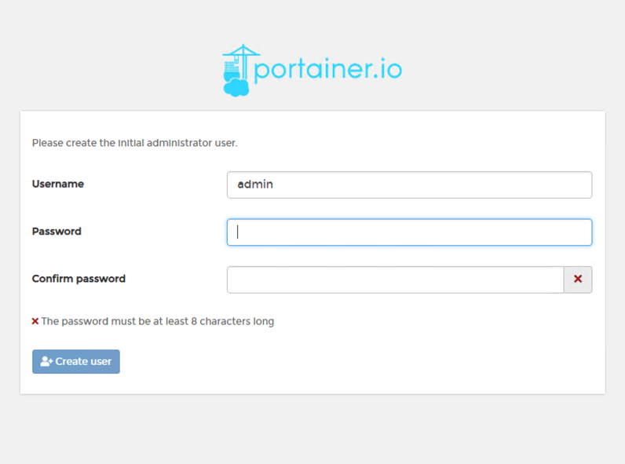
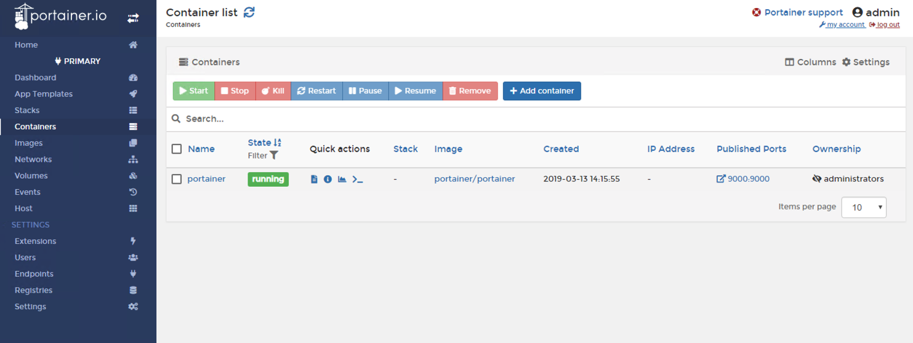

# Tutorial: Running Portainer on VIC


### Point your DOCKER_HOST variable to the VCH
Replace the variables with your VCH IP address
```
$ export DOCKER_HOST=W.X.Y.Z:2375
```

We will pass the -H flag to portainer so that it can point to the docker socker over tcp to comminicate to the VCH. Direct access to docker socket is not supported in VIC.


### Create a volume for the portainer to store data
```
$ docker volume create portainer_data
docker volume ls
DRIVER              VOLUME NAME
vsphere             portainer_data
```

### Instantiate the Portainer
Now that the volume is create, instantiate the container using the following command. Change the variables(W.X.Y.Z) to your VCH IP Address
``` 
$ docker run -d -p 9000:9000 --name portainer --restart always -v portainer_data:/data portainer/portainer -H tcp://W.X.Y.Z:2375
```

    - "-p" flag is mapping the port 9000 on VCH to port 9000 on the portainer container
    - "-v" flag is adding a volume
    - "-H" flag is passing the remote Host flag to the portainer so that portainer can access the docker socket of VCH to fetch data

### Verify that the Portainer container is running
```
$ docker ps
CONTAINER ID        IMAGE                 COMMAND                  CREATED             STATUS              PORTS                          NAMES
bca7a78c9b6f        portainer/portainer   "/portainer -H tcp:/…"   56 seconds ago      Up 21 seconds       10.40.206.184:9000->9000/tcp   portainer
```


### Access the UI 


