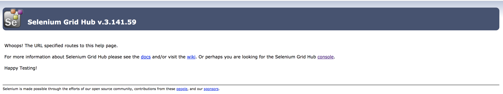

# Running Zalenium in Docker Container Host (DCH)


### Step 1: Create a volume for the DCH

```
$ docker volume create --opt Capacity=20GB --name zalenium-dch-disk
```

### Step 2: Provision the DCH

Change the "vic.tpm.local" to your harbor registry's address. If harbor is configured with sighned, the "-insecure-registry" option is not required.
```
$ docker run -d -v mydchdisk:/var/lib/docker -p 12375:2375 -p 4444:4444 --name zalenium-host vmware/dch-photon -insecure-registry vic.tpm.local
```

### Step 3: Exec into DCH

Exec into DCH to run docker commands locally
```
$ docker exec -it zalenium-host /bin/bash
```

### Step 4: Pull the required images

Pull the selenium and Zalenium containers on the DCH. These commands need to be run from DCH console after executing step 3.
```
# Pull docker-selenium
root [ / ]# docker pull elgalu/selenium

# Pull Zalenium
root [ / ]# docker pull dosel/zalenium
```


### Step 5: Run the Zalenium container

Run the Zalenium container on DCH by executing the command below. Note that this command is run from within the DCH console. 
```
root [ / ]# docker run --rm -ti --name zalenium -p 4444:4444 \
    -v /var/run/docker.sock:/var/run/docker.sock \
    -v /tmp/videos:/home/seluser/videos \
    --privileged dosel/zalenium start
```

### Step 6: Acceess the Salenium Grid UI

Reach the Selenium Grid Hub using the VCH IP with port 4444


